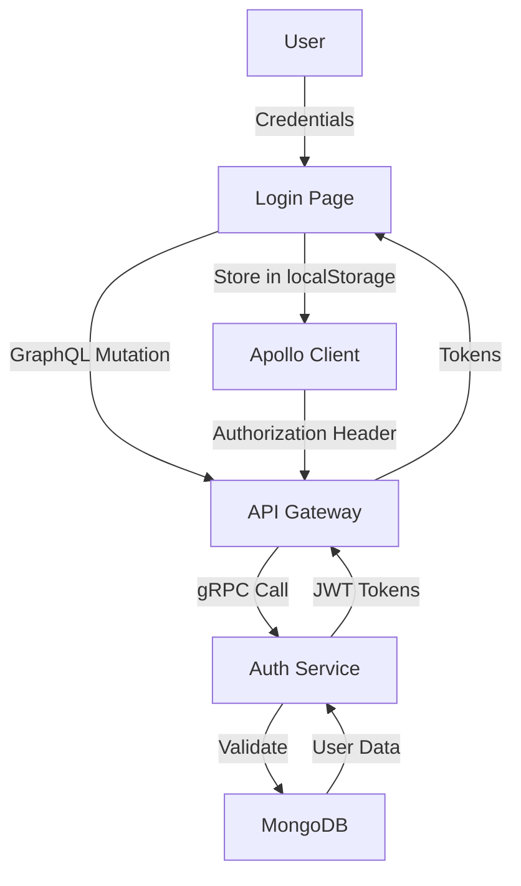
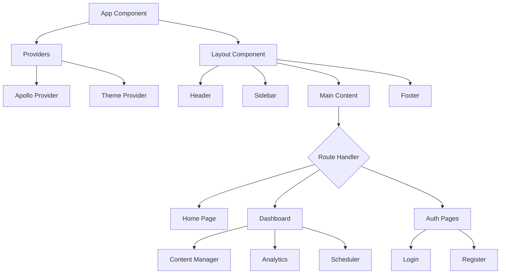
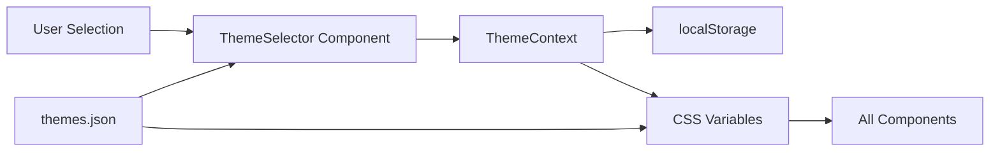
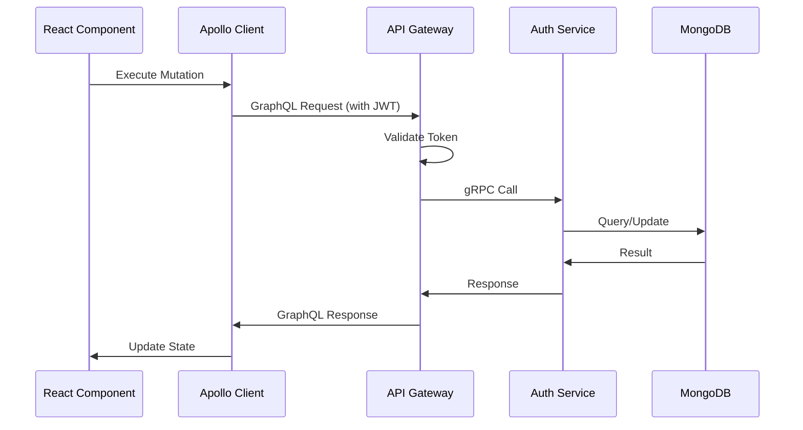
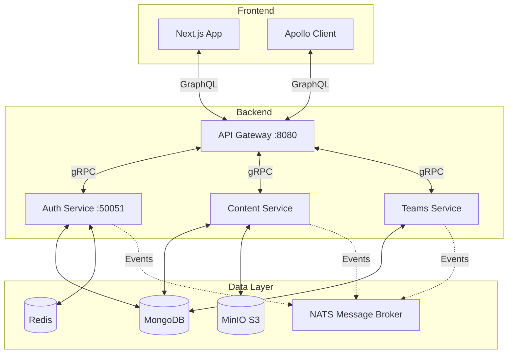
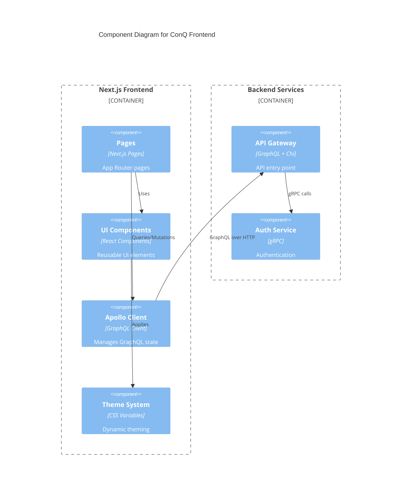
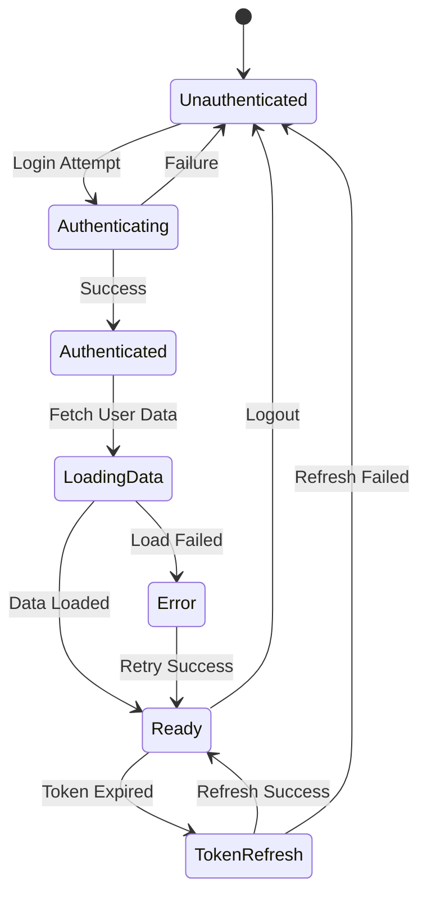
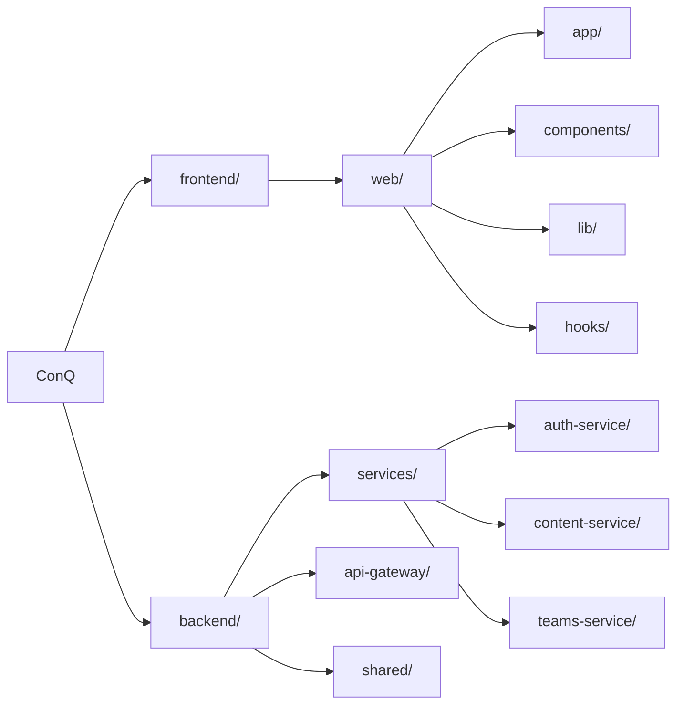

# Component Visualization Test - Mermaid Diagrams

This document demonstrates Mermaid diagram capabilities for documenting ConQ's component architecture.

## ConQ Component Architecture

### 1. Authentication Flow

### 2. Main App Component Hierarchy

### 3. Theme System Architecture

### 4. GraphQL Data Flow

### 5. Service Communication

### 6. Component Diagram (C4 Style)

### 7. State Management Flow

### 8. File Structure

## How to View These Diagrams

### Option 1: GitHub/GitLab
GitHub and GitLab automatically render Mermaid diagrams in markdown files.

### Option 2: VS Code
Install the "Markdown Preview Mermaid Support" extension.

### Option 3: Online
Use https://mermaid.live/ to preview and edit diagrams.

### Option 4: In ConQ App
We can use the `mermaid` package to render these dynamically in our Next.js app.

## Mermaid Diagram Types Available

- **Flowchart**: Process flows and component relationships
- **Sequence Diagram**: Interaction between components over time
- **Class Diagram**: Object-oriented structure
- **State Diagram**: State transitions
- **ER Diagram**: Database relationships
- **Gantt Chart**: Project timelines
- **C4 Diagram**: Software architecture (experimental)
- **Git Graph**: Version control flows

## Benefits for ConQ

1. **Documentation as Code**: Diagrams live with the codebase
2. **Version Controlled**: Track changes to architecture over time
3. **Easy to Update**: Text-based, no specialized tools needed
4. **Consistent Style**: Auto-generated formatting
5. **Developer Friendly**: Write diagrams like you write code
