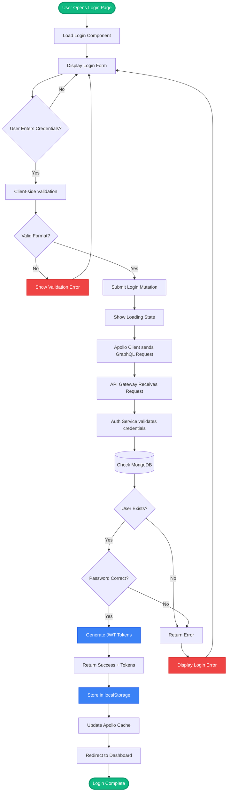
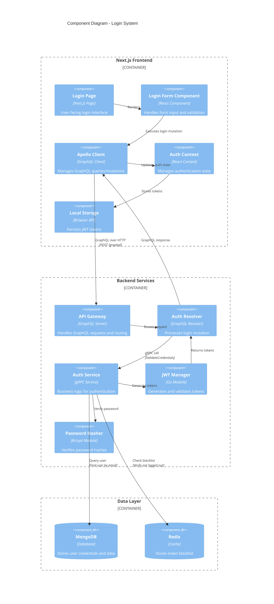
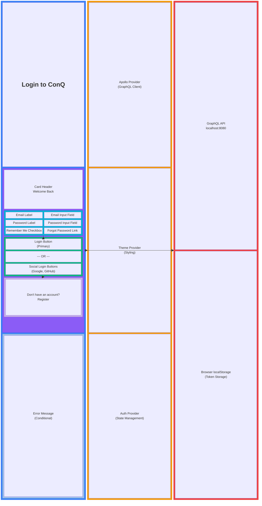
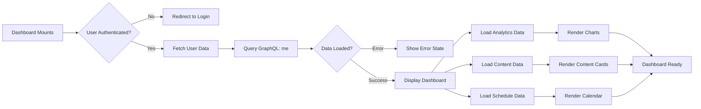
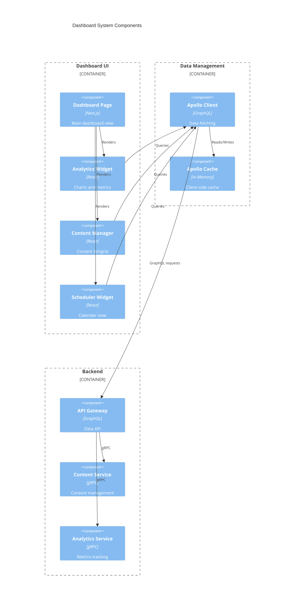
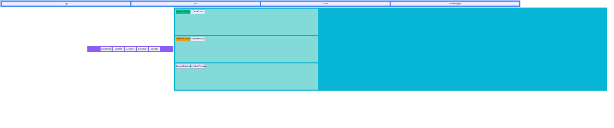

# Login Component - Mermaid Diagram Examples

This document demonstrates the **same Login component** visualized using three different Mermaid diagram types:
1. **Flowchart** - Process flow and logic
2. **C4 Component Diagram** - Software architecture view
3. **Block Diagram** - Structural composition

---

## 1. Flowchart - Login Process Flow

Shows the **step-by-step process** when a user attempts to login.

**Use Case**: Understanding the **logic flow** and **decision points** in the login process.

---

## 2. C4 Component Diagram - Login Architecture

Shows **how components interact** within the login system at an architectural level.

**Use Case**: Understanding **component responsibilities** and **communication patterns**.

---

## 3. Block Diagram - Login UI Structure

Shows the **structural composition** and **layout** of the login component.

**Use Case**: Understanding **UI structure**, **layout hierarchy**, and **component composition**.

---

## Comparison: When to Use Each Diagram Type

| Diagram Type | Best For | ConQ Use Cases |
|--------------|----------|----------------|
| **Flowchart** | Process flows, logic, decision trees | User journeys, authentication flows, data processing pipelines |
| **C4 Component** | Software architecture, component interactions | System design, service communication, API structure |
| **Block Diagram** | UI structure, layout composition, hierarchies | Component composition, page layouts, design systems |

---

## Additional Example: Dashboard Component

Let's see the **same Dashboard component** in all three styles:

### Flowchart - Dashboard Data Loading

### C4 - Dashboard Architecture

### Block Diagram - Dashboard Layout

---

## Recommendations for ConQ

### Use Flowcharts For:
- ✅ User authentication flows
- ✅ Content publishing workflow
- ✅ Error handling logic
- ✅ Data validation processes

### Use C4 Component Diagrams For:
- ✅ Overall system architecture
- ✅ Microservice interactions
- ✅ Frontend-backend communication
- ✅ Third-party integrations

### Use Block Diagrams For:
- ✅ Page layouts and structure
- ✅ Component composition
- ✅ Design system organization
- ✅ UI component hierarchies

---

## Integration with ConQ Documentation

These diagrams can be added to:

1. **README.md** - High-level architecture overview
2. **ARCHITECTURE.md** - Detailed system design
3. **Component READMEs** - Individual component documentation
4. **API Documentation** - Request/response flows
5. **Onboarding Docs** - Help new developers understand the system

All diagrams are:
- ✅ Version controlled (text-based)
- ✅ Easy to update
- ✅ Auto-rendered on GitHub
- ✅ Can be rendered in the app (via MermaidDiagram component)
